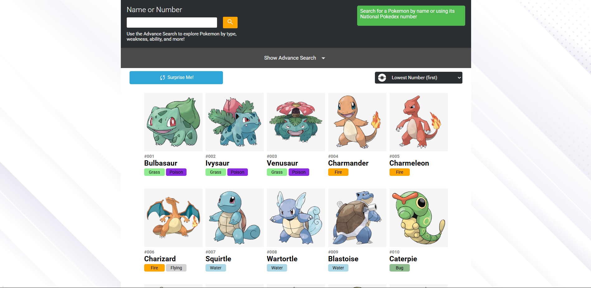

# Pokédex Explorer

**Interactive Pokédex built with React**



A small, responsive web app that aggregates multiple PokeAPI endpoints into a unified data model per Pokémon and exposes that data through a centralized Context. Browse, search, and open detail pages for each Pokémon — optimized for developer ergonomics and easy extension.

---

## Demo

Live demo: *https://poke-api-full.vercel.app/*

Repository: *https://github.com/Gerts18/PokeApi*

---

## Features

* Centralized data layer (React Context) that consolidates multiple PokeAPI endpoints into a single, easy-to-consume object per Pokémon.
* Client-side routing with bookmarkable detail pages for each Pokémon (list → detail experience like a real Pokédex).
* Search and browsing of the full Pokémon list, with support for pagination/virtualization for long lists.
* Fully responsive UI for desktop and mobile.
* Basic performance optimizations and developer-friendly code structure.

---

## Tech stack

* React + Javascript
* React Router (client-side routing)
* Fetch (network requests)
* Context API for global state / data orchestration
* Vite 

---

## Architecture / How it works

The app uses a **Pokémon Context** that is responsible for:

1. Calling the minimal set of PokeAPI endpoints required to build a complete Pokémon object.
2. Normalizing and merging the data into a single model per Pokémon so UI components can consume a single source of truth.

This pattern keeps components focused on presentation and moves all fetching/combining logic into a single, testable layer.

---

## Getting started (local)

### Prerequisites

* Node.js (14+)
* npm or yarn

*Note: PokeAPI is public and does not require an API key.*

### Install and run

```bash
# Install
npm install

# Dev server
npm run dev

# Build
npm run build

# Preview production build (Vite)
npm run preview
```
---

## Contact

German Torres — [germants180@gmail.com](mailto:germants180@gmail.com)


